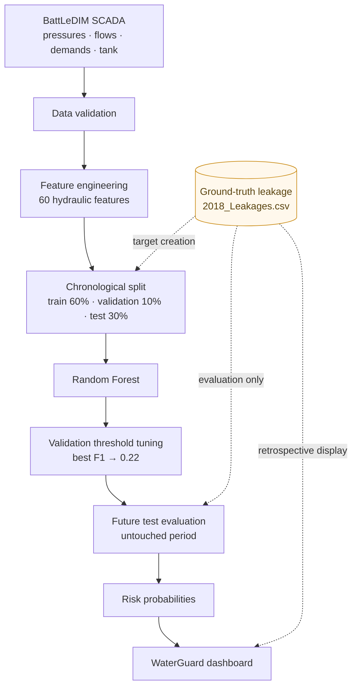
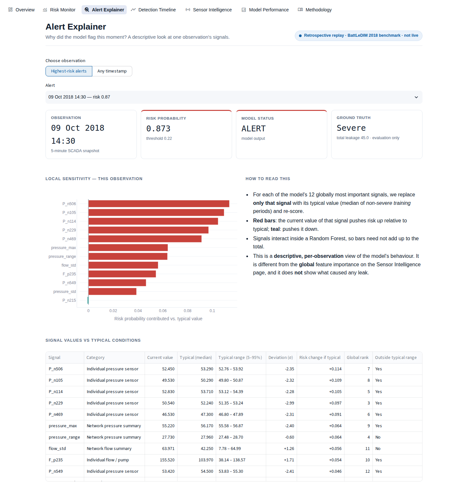

# WaterGuard AI Saudi

**An ML decision-support prototype that flags water-network conditions linked to elevated water loss, using hydraulic SCADA sensor data.**

> **Data disclaimer:** WaterGuard has a Saudi motivation, but it is evaluated on the **BattLeDIM L-Town** international leakage-detection benchmark. None of the measurements come from Saudi Arabia or any Saudi utility.

| | |
|---|---|
| **Live demo** | _Not deployed yet. See [Deployment](#deployment) (Streamlit Community Cloud, $0)._ |
| **Model** | Random Forest V2: 60 hydraulic features, chronological train/validation/test |
| **Verified test result** | ROC-AUC **0.9501** · Precision **94.24%** · Recall **38.17%** · F1 **0.5433** |
| **Stack** | Python 3.13 · pandas · scikit-learn · Plotly · Streamlit · pytest |


---

## 1. Problem

Water distribution networks lose water through leaks. Many leaks are small and persistent. Others are large and build up over days. Utilities collect SCADA data (pressures, flows, tank levels) every few minutes, but looking through thousands of signals by hand is slow. WaterGuard asks one product question:

> *Where does the network appear to be experiencing elevated water-loss risk, what hydraulic signals made the model flag it, and how well does the AI perform?*

### Why it matters (Saudi context)
Saudi Arabia's Ministry of Environment, Water and Agriculture (MEWA) lists reducing losses in distribution networks as an improvement opportunity in its [National Water Strategy](https://www.mewa.gov.sa/en/Ministry/Agencies/TheWaterAgency/Topics/Pages/Strategy.aspx). The strategy page estimates network losses at more than 25% in some regions. WaterGuard explores how sensor analytics could support that kind of work. **The motivation is Saudi. The evaluation is on an international benchmark.**

## 2. Research question
*Can machine-learning analysis of pressure, flow, demand and tank-level patterns identify network conditions associated with elevated water loss? And how reliably does it work on a later period the model has never seen?*

## 3. Dataset provenance
- **BattLeDIM 2020** (Battle of the Leakage Detection and Isolation Methods), L-Town network, 2018 files.
  Vrachimis, S. G. et al., *Dataset of BattLeDIM*, Zenodo, [doi:10.5281/zenodo.4017659](https://doi.org/10.5281/zenodo.4017659). Licence: **CC BY 4.0**.
- `2018_SCADA.xlsx`: 105,120 timestamps at 5-minute resolution. Sheets: Pressures (33 sensors, m), Demands (82, L/h), Flows (3, m³/h), Levels (1 tank, m).
- `2018_Leakages.csv`: leak magnitude at 14 locations (p31, p158, p183, p232, p257, p369, p427, p461, p538, p628, p654, p673, p810, p866). It uses `;` as the separator and `,` as the decimal mark, so it must be read with `sep=";", decimal=","`.
- Audit result: no duplicate timestamps, no gaps, no missing values, and all sheets are row-aligned (`outputs/audit_report.json`).
- Raw data is **not committed** because of its size. See [Data setup](#data-setup).

## 4. Pipeline



The ground-truth leakage defines the training labels and scores the results. It is **never** a model input.

## 5. Methodology

**Target definition.** In 97.8% of timestamps, at least one leak is above zero, because several small leaks (p257, p427, p654, p810) persist for most of the year. A naive "any leak > 0" target is therefore almost always 1 and useless. WaterGuard instead flags **total leakage ≥ 40**. This is an *experimental benchmark severity threshold* at about the 80th percentile of 2018 total leakage. It is **not** an official engineering, utility, regulatory or Saudi threshold.

**Features (V2, 60).** The 33 individual pressure sensors; network pressure mean, min, max, std and range; demand total, mean and std; the 3 individual flows plus their total, mean and std; tank level; cyclical hour of day (sin/cos); and 5-minute and 30-minute changes in key signals. Calendar month is **intentionally excluded**. Every feature uses only current or past values.

**Evaluation design.** The split is chronological, with no shuffling:

| Split | Period | Rows | Severe rate |
|---|---|---:|---:|
| Train | 2018-01-01 00:00 → 2018-08-07 23:55 | 63,072 | 16.9% |
| Validation | 2018-08-08 00:00 → 2018-09-13 11:55 | 10,512 | 13.0% |
| Test | 2018-09-13 12:00 → 2018-12-31 23:55 | 31,536 | 28.5% |

The median imputer is fitted on training data only. The alert threshold is the best F1 over 0.05–0.80 on **validation only**. The test period is scored once.

## 6. V1 baseline (kept as an honest record)
Random Forest, 20 aggregate features (including `month`), chronological 70/30 split, default 0.5 threshold.

| Precision | Recall | F1 | ROC-AUC |
|---:|---:|---:|---:|
| 0.4255 | 0.0022 | 0.0044 | 0.8602 |

V1 could *rank* risk (AUC 0.86), but at the default threshold it raised almost no alerts (47 in total). Its most important feature was `month` (0.229). That suggests it partly learned *when* leaks happened in 2018 rather than *what they look like hydraulically*.

## 7. V2 improvements
- Kept the individual pressure sensors, because local signals get lost in averages.
- Added flow, tank, cyclical-hour and short-term change features.
- **Removed `month`.**
- Added a separate validation period, so the alert threshold is tuned without touching test data.

## 8. Verified V2 results (untouched test period)

| Metric | Value |
|---|---:|
| ROC-AUC | **0.9501** |
| Precision | **0.9424** |
| Recall | **0.3817** |
| F1 | **0.5433** |
| PR-AUC (average precision) | 0.8806 |
| Alert threshold (from validation) | 0.22 |
| Validation precision / recall / F1 at 0.22 | 0.3109 / 0.7036 / 0.4312 |

### Confusion matrix

| | Predicted not severe | Predicted severe |
|---|---:|---:|
| **Actual not severe** | TN = 22,332 | FP = 210 |
| **Actual severe** | FN = 5,561 | TP = 3,433 |

**How to read it.** V2 raised 3,643 alerts, and 3,433 of them fell in genuinely severe periods (precision 94%). It missed 5,561 of the 8,994 severe 5-minute steps (recall 38%). In practice it produces **few false alarms but misses many severe periods**.

### What the numbers hide (important context)
- **Two episodes only.** The 8,994 severe test steps belong to just **two** leak episodes: 6–23 Oct (p158) and 26 Oct–8 Nov (p369). V2 alerted within the first 5-minute step of both. It then stayed above threshold for 48% and 26% of their duration. Two episodes are too few to support claims about event-level performance.
- **Prevalence shift.** Severe steps make up 13.0% of validation but 28.5% of test. That is partly why validation precision (31%) and test precision (94%) differ so much.
- **F1 context.** An "always alert" rule scores F1 0.444 on this test set. V2's value lies in its **precision and ranking**, not in F1 alone.

### Baselines (same split; each threshold chosen on validation) — `scripts/run_experiments.py`

| Model | Precision | Recall | F1 | ROC-AUC |
|---|---:|---:|---:|---:|
| **Random Forest V2** | **0.9424** | 0.3817 | **0.5433** | **0.9501** |
| Always alert | 0.2852 | 1.0000 | 0.4438 | 0.5000 |
| Single signal (`pressure_std`) | 0.2853 | 1.0000 | 0.4439 | 0.6055 |
| Logistic Regression (60 features) | 0.2135 | 0.0067 | 0.0129 | 0.2200 |
| Isolation Forest (unsupervised) | 0.4567 | 0.2860 | 0.3517 | 0.7406 |

Logistic Regression ranks the test period **worse than random**. The linear relationships it learned from the training-period leaks reverse for the test-period leaks, which is evidence that leak signatures are non-stationary. This is a real caution about how well any model here would generalise.

### Sensitivity to the severity definition (supplementary retraining; V2 at 40 remains the reported model)

| Severe if total ≥ | Test prevalence | Precision | Recall | F1 | ROC-AUC |
|---:|---:|---:|---:|---:|---:|
| 30 | 28.5% | 0.6752 | 0.9415 | 0.7864 | 0.9579 |
| 35 | 28.5% | 0.8867 | 0.5481 | 0.6775 | 0.9518 |
| 37.56 (training-only 80th pct.) | 28.5% | 0.9473 | 0.4194 | 0.5814 | 0.9530 |
| **40 (V2)** | 28.5% | **0.9424** | **0.3817** | **0.5433** | **0.9501** |
| 45 | 16.8% | 0.7699 | 0.3370 | 0.4688 | 0.9151 |
| 50 | no positives in validation or test | – | – | – | – |

## 9. Important features
Top V2 Random Forest importances: `P_n215`, `pressure_std`, `P_n229`, `pressure_range`, `P_n114`, `P_n469`, `P_n506`, `P_n105`, `pressure_max`, `F_p235`. By category, individual pressure sensors account for 61% of total importance and network pressure summaries for 23%.

These features contributed strongly to the Random Forest's predictions. Feature importance **does not prove causation**, and sensor IDs are L-Town benchmark node names, not physical locations anywhere real.

## 10. Dashboard
Seven pages, all built from pre-computed files in `outputs/`:

| Page | What it shows |
|---|---|
| **Overview** | Verified KPIs, the risk timeline with ground-truth severe periods shaded, and an episode-level table |
| **Risk Monitor** | Date filter, a what-if threshold slider (clearly marked exploratory), the highest-risk table, and CSV export |
| **Alert Explainer** | For any test timestamp: probability, status, signal values against typical ranges, and a local "what if this signal were typical" sensitivity |
| **Detection Timeline** | Ground-truth leakage with alerts (top) and model risk (bottom) on a shared time axis |
| **Sensor Intelligence** | Global importances, importance by category, a signal explorer with typical bands, and plain-language signal explanations |
| **Model Performance** | Confusion matrix, ROC and PR curves, threshold-selection curve, split diagram, baselines, V1 vs V2, severity sensitivity |
| **Methodology** | Research question, provenance, pipeline, limitations, future work, responsible use |

The dashboard is always labelled as a **retrospective replay** of benchmark data. It is never presented as live monitoring. Ground-truth columns are labelled "evaluation only" throughout.

| Alert Explainer | Model Performance |
|---|---|
|  |  |

## 11. Repository structure
```
waterguard-ai-saudi/
├── app.py                      # Streamlit dashboard
├── requirements.txt            # pinned runtime deps (verified together)
├── requirements-dev.txt        # + pytest
├── .streamlit/config.toml      # theme
├── src/
│   ├── inspect_data.py         # original exploration scripts (kept)
│   ├── analyze_leaks.py
│   ├── severity_analysis.py
│   ├── train_v1.py             # original V1 training (unchanged)
│   ├── train_v2.py             # original V2 training (unchanged)
│   └── waterguard/             # importable, tested pipeline code
│       ├── config.py  data.py  features.py  target.py
│       ├── evaluation.py       # metrics + episode-level analysis
│       └── dashboard_data.py
├── scripts/
│   ├── download_data.py        # fetch BattLeDIM files from Zenodo
│   ├── build_dashboard_data.py # re-applies saved V2, verifies reproduction, exports dashboard files
│   └── run_experiments.py      # baselines + sensitivity analyses
├── outputs/                    # verified predictions + dashboard/experiment files (committed, ~10 MB)
├── models/                     # *.joblib (git-ignored, regenerate with src/train_v2.py)
├── data/                       # raw data (git-ignored, see data/README.md)
├── tests/                      # pytest suite
├── docs/screenshots/
├── LEARNING_GUIDE.md           # plain-language explanation + interview Q&A
└── PROJECT_REPORT.md           # development / audit log
```

## 12. Installation
```bash
git clone <your-repo-url> waterguard-ai-saudi
cd waterguard-ai-saudi
python -m venv .venv
# Windows: .venv\Scripts\activate     macOS/Linux: source .venv/bin/activate
pip install -r requirements-dev.txt
```
The pinned versions need **Python 3.12 or newer** (3.13 verified).

### Data setup
```bash
python scripts/download_data.py      # or download manually, see data/README.md
```

## 13. How to run
```bash
streamlit run app.py                 # dashboard (needs only outputs/)
```
To reproduce from raw data:
```bash
python src/train_v1.py               # V1 baseline  -> models/, outputs/
python src/train_v2.py               # V2 model     -> models/, outputs/  (deterministic, random_state=42)
python scripts/build_dashboard_data.py
python scripts/run_experiments.py    # ~4 minutes
```
`build_dashboard_data.py` checks that the saved model reproduces `outputs/predictions_v2.csv`. The maximum probability difference observed was 2.2e-16.

## 14. Testing
```bash
python -m pytest -q
```
The suite covers leakage CSV parsing, expected dataset columns and alignment, feature generation (60/20 features, no month in V2, causal features), exclusion of ground-truth fields from features, chronological split ordering, the verified V1 and V2 metrics, threshold consistency, model artifact loading and probability range, the required dashboard outputs, and a render test of every dashboard page. Tests that need raw data or model files are **skipped** (not failed) when those files are absent, as on a fresh clone.

## 15. Limitations
- It is a **simulated benchmark network** covering one year, not real Saudi utility data.
- The test period contains only **two** severe leak episodes.
- **Recall is limited (38%).** The model often alerts at the start of an episode and then drops below threshold.
- The 40 threshold was set by looking at the full-year leakage distribution. This affects the label definition only; no future information enters the features. Using a training-only percentile (37.56) gives similar results.
- Leak signatures shift over time. Logistic Regression's AUC of 0.22 shows this.
- The model says **when**, not **where**. There is no leak localisation.
- Probabilities are not calibrated.

## 16. Future work
Evaluate on the 2019 BattLeDIM data. Add event-based alerting (persistence or hysteresis) to raise episode coverage. Localise leaks using the L-Town hydraulic model. Calibrate probabilities. Use rolling-origin (walk-forward) validation. Eventually test on real utility data under a proper data-sharing agreement.

## 17. Responsible use
WaterGuard AI Saudi is an **educational research prototype**. It is not an operational system. It has no partnership with, or endorsement from, any Saudi utility or government body, has not been validated on Saudi network data, and must not be used for operational decisions. Feature importance and the Alert Explainer describe **model behaviour**, not the physical causes of leaks.

## Deployment
Target: **Streamlit Community Cloud** (free). The app needs only `app.py`, `src/waterguard/`, `outputs/` and `requirements.txt`. It does not need the raw data or the model files.
1. Push this repository to a **public** GitHub repo.
2. At <https://share.streamlit.io> choose **Create app → Deploy a public app from GitHub**, pick the repo and branch, and set the main file to `app.py`. Under *Advanced settings*, choose **Python 3.13**.
3. Paste the resulting `https://<name>.streamlit.app` URL into the "Live demo" row at the top of this README.

## Author / project context
Built by **[Your Name]** as an independent AI/Data Science portfolio project, as preparation for undergraduate study in AI Engineering / Data Science. The dataset is credited to the BattLeDIM authors (CC BY 4.0).
