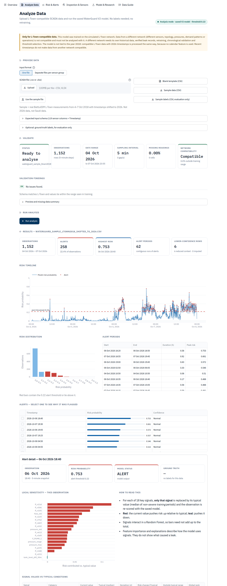
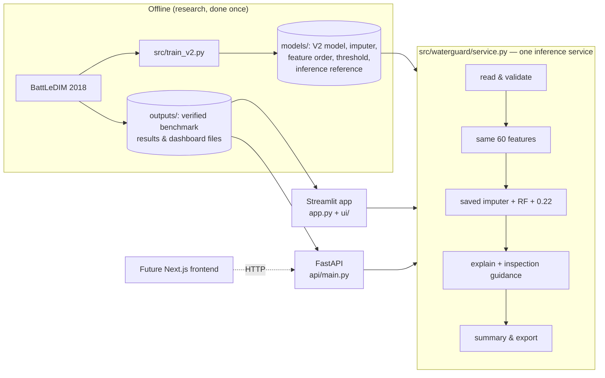

# WaterGuard AI Saudi

**An ML water-loss decision-support research prototype. Give it L-Town-compatible hydraulic SCADA data and it returns risk probabilities, alerts, per-alert explanations, sensor inspection guidance and an exportable predictions file — using a model whose performance was verified on a held-out benchmark period.**

> **Data disclaimer.** WaterGuard is *motivated* by water loss in Saudi Arabia, but it is *trained and evaluated* on the **BattLeDIM L-Town** international leakage-detection benchmark (a simulated network). None of the measurements come from Saudi Arabia, any Saudi utility or any Saudi government body.

| | |
|---|---|
| **Live demo** | _Not deployed yet — see [Deployment](#14-deployment)._ |
| **GitHub** | _Add the repository URL after publishing._ |
| **Model** | Random Forest V2 — 60 hydraulic features, chronological train / validation / test |
| **Verified test result** | Precision **94.24%** · Recall **38.17%** · F1 **0.5433** · ROC-AUC **0.9501** (threshold 0.22) |
| **Product** | Streamlit app (6 sections) + FastAPI inference API, sharing one Python service layer |
| **Stack** | Python 3.13 · pandas · scikit-learn · Plotly · Streamlit · FastAPI · pytest |
| **Author** | Eman Musheer |



---

## 1. What it does
WaterGuard answers: *"Can I give WaterGuard compatible hydraulic SCADA data and receive useful ML risk analysis?"*

```
UPLOAD → VALIDATE → BUILD THE SAME 60 FEATURES → SAVED IMPUTER → SAVED V2 RANDOM FOREST
       → RISK PROBABILITY → ALERT IF ≥ 0.22 → EXPLANATION → INSPECTION GUIDANCE → EXPORT
```

No labels are needed and nothing is retrained when a file is analysed. The verified 2018 evaluation stays available as the **benchmark demo**.

## 2. Saudi relevance (motivation only)
Saudi Arabia's Ministry of Environment, Water and Agriculture (MEWA) publishes a National Water Strategy. Its current-state assessment lists the reduction of losses in the network as an opportunity to improve urban water use, and estimates those losses at more than 25% in different regions ([MEWA, National Water Strategy page](https://www.mewa.gov.sa/en/Ministry/Agencies/TheWaterAgency/Topics/Pages/Strategy.aspx), last edited 6 July 2025).

**Saudi context = motivation and target application. BattLeDIM L-Town = experimental data.** No result here says anything about performance on a Saudi network.

## 3. The application — six sections
| Section | What it offers |
|---|---|
| **Overview** | What WaterGuard is, the two modes, verified headline metrics with the precision-vs-recall explanation, benchmark risk timeline, episode table, limitations |
| **Analyze Data** *(primary feature)* | Upload a CSV/XLSX (or four per-group files), schema + template + sample, validation panel (rows, date range, interval, gaps, missing data, network compatibility), run the saved model, results (summary, timeline, risk distribution, alert periods, alert table → explanation + inspection guidance), optional evaluation against your labels, CSV/JSON export |
| **Risk & Alerts** | Monitor (date range, exploratory threshold, alert table → alert explanation) and detection timeline — for the benchmark **or** your analysis |
| **Inspection & Sensors** | Network map with time-of-day-adjusted pressure deviations, suggested inspection order; impurity vs held-out permutation importance; signal explorer — for either data source |
| **Model & Research** | Performance (confusion matrix, ROC/PR, validation threshold curve, split, baselines, V1→V2, severity sensitivity), methodology, dataset & Saudi context, using other data (2018 vs 2026, different networks), limitations & responsible use |
| **Data Guide** | Requirements, accepted formats, full column schema, validation rules, output-column dictionary, FAQ |

**Two modes, never mixed.** *Benchmark demo* = the verified held-out 2018 evaluation, with ground truth (labelled *evaluation only*). *Your analysis* = an uploaded file; it becomes the active session for Risk & Alerts and Inspection & Sensors without re-uploading. Benchmark ground truth is never shown against uploaded data. Every page header shows which mode is active.

## 4. Input schema (Analyze Data and the API)
One row per **5-minute** timestamp, any year:

| Group | Prefix | Columns | Unit |
|---|---|---:|---|
| Pressures | `P_` | 33 (`P_n1 … P_n769`) | m |
| Demands | `D_` | 82 (`D_n1 …`) | L/h |
| Flows | `F_` | 3 (`F_p227`, `F_p235`, `F_PUMP_1`) | m³/h |
| Tank level | `L_` | 1 (`L_T1`) | m |

Plus a `Timestamp` column. Accepted: wide CSV (`,` or `;` with decimal commas), wide XLSX, the BattLeDIM 4-sheet workbook (e.g. `2019_SCADA.xlsx` as downloaded), or four separate per-group files (e.g. `2019_SCADA_Pressures.csv` …). Prefixes are needed because some nodes carry both a pressure sensor and a demand meter. Limits: 100 MB, 12–110,000 rows. Template and sample: [`samples/`](samples/README.md).

**Validation** rejects missing timestamps/sensors, duplicate timestamps, non-5-minute or off-grid sampling, empty columns and unreadable files; it sorts unsorted rows, reports gaps, imputes and flags missing readings, drops extra and label-like columns (never used by the model), and checks **network compatibility**: the share of readings outside the range seen in training (≤ 5% compatible, ≤ 25% caution, otherwise out of distribution).

## 5. Training vs inference, 2018 vs 2026, other networks
- **Training** (offline, once: `src/train_v2.py`) needs labelled history and produced the saved model, imputer, feature order and threshold. **Inference** (Analyze Data, API) only applies them. Verified: on the full 2018 data the inference service reproduces the benchmark test probabilities to within 2.2e-16, with identical alerts.
- **2026 timestamps work.** No calendar feature is used. The sample file (L-Town measurements from 4–7 Oct 2018 shifted to 2026) gives exactly the benchmark probabilities from the 7th row onward; the first 6 rows (30 minutes) are flagged *reduced context* because the change features lack history.
- **Time recency is not network compatibility.** A physically different (e.g. Saudi) network has different sensor IDs, topology, pressure distributions, demand patterns, flows, tanks and operations. Its data is not valid input for this L-Town model. It would need: historical SCADA + verified leak records → network-specific preprocessing → training/adaptation → chronological validation → threshold selection → deployment → incoming-SCADA inference.
- **Real unseen-year check (supplementary).** The official BattLeDIM **2019** workbook (92 MB, 105,120 rows) was uploaded through the same pipeline: validation passed (1.4% of readings outside the training range → compatible) and the analysis took about 1.5 minutes. With the 2019 leakage file as optional labels: precision 0.998, recall 0.678, ROC-AUC 0.972. **Caution:** 2019 leakage is far higher (median 75.9 vs 23.9 m³/h), so 82% of 2019 counts as "severe" under the 2018-derived 40 m³/h definition — an "always alert" rule would already reach precision 0.82. These numbers are not comparable with the 2018 benchmark and do not replace it.

## 6. Research question
*Can machine-learning analysis of pressure, flow, demand and tank-level patterns identify network conditions associated with severe water-loss periods in a benchmark distribution network — and how reliably does it work on a later period the model has never seen?*

## 7. Data and target
- **BattLeDIM 2020**, L-Town network, 2018 files (Vrachimis et al., 2020, Zenodo, [doi:10.5281/zenodo.4017659](https://doi.org/10.5281/zenodo.4017659), **CC BY 4.0**; site <https://battledim.ucy.ac.cy/>). 105,120 five-minute timestamps; 33 pressure, 82 demand, 3 flow and 1 tank signal; leakage (m³/h) at 14 pipes. The leakage CSV uses `;` and decimal commas — pandas defaults fail with a `ParserError` at line 2312.
- In **97.8%** of timestamps some leak is above zero (small long-running leaks), so "any leak > 0" is useless as a target. A 5-minute step is **severe** when **total leakage ≥ 40 m³/h** (≈ 80th percentile of 2018; 19.98% of timestamps). **This is an experimental modelling threshold**, not an engineering, BattLeDIM, utility, regulatory or Saudi standard.

## 8. Method
- **Features (60, current/past values only):** 33 individual pressures; pressure mean/min/max/std/range; demand total/mean/std; 3 flows + total/mean/std; tank level; hour of day as sin/cos; 5- and 30-minute changes of pressure mean/min/std, flow total and tank level. **No month.**
- **Chronological split:** train 1 Jan–7 Aug (63,072 rows, 16.9% severe), validation 8 Aug–13 Sep (10,512, 13.0%), test 13 Sep–31 Dec (31,536, 28.5%). Median imputer fitted on train only.
- **Model:** `RandomForestClassifier(n_estimators=300, max_depth=16, min_samples_leaf=4, class_weight="balanced_subsample", random_state=42)`.
- **Threshold:** best F1 on **validation only** → **0.22** (validation P 0.3109 / R 0.7036 / F1 0.4312). The test period is scored once.
- **V1 baseline (kept):** 20 aggregate features incl. `month` (its top feature, 0.229), 70/30 split, default 0.5 threshold → precision 0.4255, recall 0.0022, F1 0.0044, ROC-AUC 0.8602 (only 47 alerts). Good ranking, useless at the default threshold.

## 9. Verified results (untouched test period)
| | Predicted not severe | Predicted severe |
|---|---:|---:|
| **Actually not severe** | TN = 22,332 | FP = 210 |
| **Actually severe** | FN = 5,561 | TP = 3,433 |

| Precision | Recall | F1 | ROC-AUC | PR-AUC | Accuracy |
|---:|---:|---:|---:|---:|---:|
| **0.9424** | **0.3817** | **0.5433** | **0.9501** | 0.8806 | 0.8170 |

V2 raised 3,643 alerts; 3,433 were during genuinely severe periods. It **missed 5,561 of 8,994 severe steps**. **94% precision does not mean 94% of leaks are detected.** The severe test steps form only **two** episodes (pipe p158, 6–23 Oct; p369, 26 Oct–8 Nov); V2 alerted at the first step of both and covered 47.6% and 26.2% of them. Validation vs test prevalence (13.0% vs 28.5%) explains much of the precision gap (0.31 vs 0.94).

| Baseline (same split, validation-chosen thresholds) | Precision | Recall | F1 | ROC-AUC |
|---|---:|---:|---:|---:|
| **Random Forest V2** | **0.9424** | 0.3817 | **0.5433** | **0.9501** |
| Always alert | 0.2852 | 1.0000 | 0.4438 | 0.5000 |
| Single signal (`pressure_std`) | 0.2853 | 1.0000 | 0.4439 | 0.6055 |
| Logistic Regression | 0.2135 | 0.0067 | 0.0129 | 0.2200 |
| Isolation Forest | 0.4567 | 0.2860 | 0.3517 | 0.7406 |

Severity sensitivity (retrained): F1 0.7864 at ≥30, 0.6775 at ≥35, 0.5814 at ≥37.56 (training-only 80th percentile), 0.5433 at ≥40, 0.4688 at ≥45; ≥50 has no positives.

**Feature importance.** By training-time impurity importance `P_n215` leads; by **held-out permutation importance** `P_n229` leads (test AUC drop 0.167) and `P_n215` is **#54 of 60** — it is almost constant (≈39.09 m) and dropped only during the March training leak. Importance describes model behaviour, not causes.

**Inspection guidance.** Pressure sensors ranked by drop below their usual level for the time of day (from normal training periods). On the two test episodes the sensor nearest the true leaking pipe ranked **#1** and **#2 of 33** — encouraging, but *inspection guidance, not leak localisation*.

## 10. Architecture

Streamlit and the API contain no model logic; both call the same functions (`read_table`, `validate_input`, `prepare_features`, `run_inference`, `explain_alert`, `generate_inspection_guidance`, `summarize_results`, `evaluate_against_ground_truth`). Approved scientific wording lives in one place (`src/waterguard/wording.py`).

## 11. Repository structure
```
waterguard-ai-saudi/
├── app.py                         # Streamlit entry point (6 sections)
├── ui/                            # Streamlit UI only: common.py + pages/{overview,analyze,alerts,inspect_sensors,research,data_guide}.py
├── api/main.py                    # FastAPI inference API (same service)
├── src/waterguard/
│   ├── service.py                 # inference service: read, validate, features, infer, explain, inspect, summarise, evaluate
│   ├── schema.py  wording.py      # input schema; approved scientific wording
│   ├── config.py  data.py  features.py  target.py  evaluation.py  inspection.py  dashboard_data.py
├── src/train_v1.py  src/train_v2.py  src/*.py   # original research scripts (the reported models)
├── scripts/                       # download_data, build_dashboard_data, build_inspection_data,
│                                  # build_inference_reference, run_experiments
├── models/                        # V2 artifacts (committed) + inference reference files
├── outputs/                       # verified benchmark results + dashboard files (committed)
├── samples/                       # template, sample (2018 data shifted to 2026), sample labels
├── data/                          # raw benchmark data (git-ignored; download script)
├── tests/                         # pytest suite (pipeline, service, API, app)
├── docs/                          # FRONTEND_SPEC.md, API.md, PORTFOLIO.md, ACCEPTANCE_CHECKLIST.md, screenshots
├── DEVELOPMENT_LOG.md  LEARNING_GUIDE.md  PROJECT_REPORT.md
└── requirements.txt  requirements-api.txt  requirements-dev.txt
```

## 12. Run it locally
```bash
git clone <your-repo-url> waterguard-ai-saudi
cd waterguard-ai-saudi
python -m venv .venv
# Windows: .venv\Scripts\activate      macOS/Linux: source .venv/bin/activate
pip install -r requirements-dev.txt      # Python >= 3.12 (3.13 verified); app-only: requirements.txt
```
**Streamlit app** (needs only committed files):
```bash
streamlit run app.py                      # http://localhost:8501
```
**Inference API:**
```bash
uvicorn api.main:app --port 8000          # docs at http://localhost:8000/docs  (see docs/API.md)
```
**Reproduce the research from raw data** (from the project root):
```bash
python scripts/download_data.py           # BattLeDIM 2018 files + L-TOWN.inp (~100 MB)
python src/train_v1.py                    # V1 -> models/, outputs/
python src/train_v2.py                    # V2 -> models/, outputs/  (deterministic, seed 42)
python scripts/build_inspection_data.py   # inspection guidance, network map, permutation importance
python scripts/build_dashboard_data.py    # verifies saved V2 reproduces predictions; dashboard files
python scripts/build_inference_reference.py   # schema, training ranges, typical values for inference
python scripts/run_experiments.py         # baselines + sensitivity (~4 min)
```
Retraining V2 reproduces the saved test probabilities to within 3e-16, and the experiment files are byte-identical.

## 13. Testing
```bash
python -m pytest -q
```
Covers: leakage-CSV parsing; SCADA structure; V1/V2 features (60/20, no month, causal, no ground truth); split ordering; verified V1/V2 metrics; threshold; model artifacts; **inference service** — valid data, 2026 timestamps (identical to benchmark), missing timestamp, missing sensors, unprefixed columns, extra columns, duplicate/unsorted timestamps, missing and non-numeric values, empty columns, invalid/off-grid sampling, gaps, row limits, time zones, out-of-distribution values, malformed/European CSV, malformed XLSX, wide XLSX and BattLeDIM workbook, per-group files, probability range, threshold application, feature order, ground-truth absence and exclusion, separate evaluation, explanations, full-benchmark equivalence; **API** — health, model info, schema, sample files, analyze (with/without labels), errors, explain, per-group analysis, benchmark endpoints; **app** — every section, the upload→run flow, user mode, empty states. Tests needing raw data are skipped on a fresh clone.

## 14. Deployment
- **Streamlit Community Cloud** (free): push to a public GitHub repo → <https://share.streamlit.io> → *Create app* → repo, branch `main`, main file `app.py`, *Advanced settings* → Python 3.13. Uses `requirements.txt`. The V2 model (25 MB) is committed so Analyze Data works there; raw data is not needed.
- **API** (optional, for a custom frontend): any container host; `pip install -r requirements-api.txt`, start `uvicorn api.main:app --host 0.0.0.0 --port $PORT`, set `WATERGUARD_CORS_ORIGINS`.
- **Professional frontend:** build from [`docs/FRONTEND_SPEC.md`](docs/FRONTEND_SPEC.md) against the API.

## 15. Limitations
Simulated network, one year; two severe test episodes; recall 38%; experimental 40 m³/h threshold (read from the full-year distribution; training-only 37.56 gives similar results); non-stationary leak signatures (Logistic Regression AUC 0.22); top impurity feature contributes little on held-out data; the model says *when*, not *where*; only L-Town-compatible data can be analysed; probabilities uncalibrated; 5-minute steps are correlated.

## 16. Responsible use
WaterGuard AI Saudi is an independent educational research prototype and is not affiliated with or endorsed by a Saudi government entity or water utility. It has not been validated on real Saudi network data and must not be used for operational decisions. It is not live monitoring. Explanations, importance and inspection guidance describe model and sensor behaviour, not physical causes or confirmed leak locations.

## 17. Future work
Episode-aware alerting (persistence/hysteresis) with event-level metrics; walk-forward validation; probability calibration on validation; model-based leak localisation with the L-Town hydraulic model; a properly re-defined severity target for years with different leakage levels (2019); and, only under a data-sharing agreement, a network-specific model for real utility data. Future real-world system (**does not exist**): SCADA stream → real-time validation & features → model → risk score → operator dashboard → field inspection → feedback labels.

## 18. Citations and licence
- Vrachimis, S. G., Eliades, D. G., Taormina, R., Ostfeld, A., Kapelan, Z., Liu, S., Kyriakou, M. S., Pavlou, P., Qiu, M., & Polycarpou, M. M. (2020). *Dataset of BattLeDIM: Battle of the Leakage Detection and Isolation Methods* (v1). Zenodo. https://doi.org/10.5281/zenodo.4017659 — CC BY 4.0.
- BattLeDIM competition website: https://battledim.ucy.ac.cy/
- Ministry of Environment, Water and Agriculture (MEWA). *National Water Strategy* (web page, last edited 6 July 2025). https://www.mewa.gov.sa/en/Ministry/Agencies/TheWaterAgency/Topics/Pages/Strategy.aspx

Raw BattLeDIM files are not committed (size); `scripts/download_data.py` fetches them. The sample file in `samples/` is a CC BY 4.0 excerpt with shifted timestamps, redistributed with attribution. No licence has been chosen yet for this project's own code.
