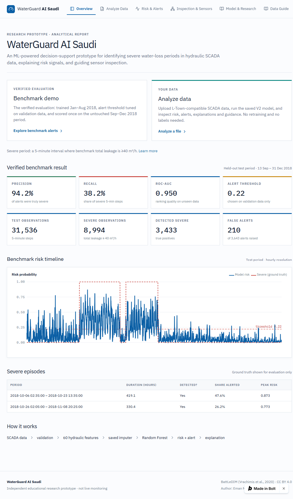
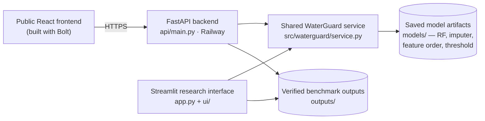
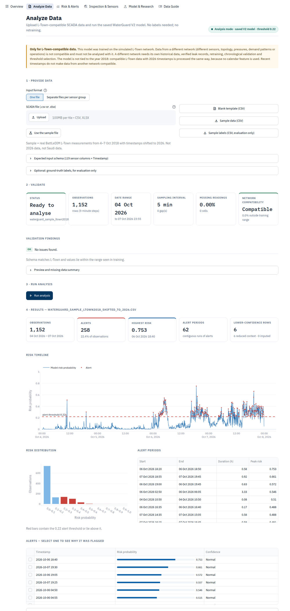
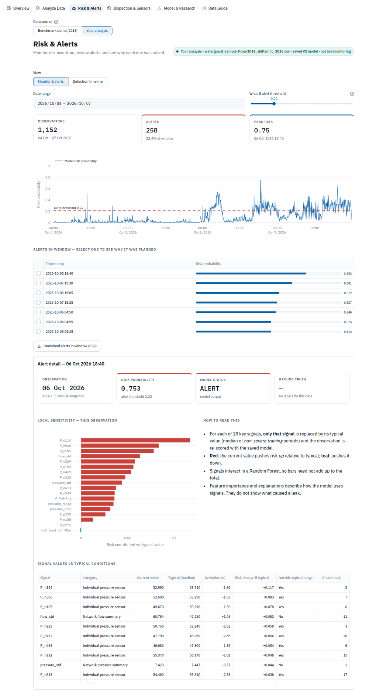
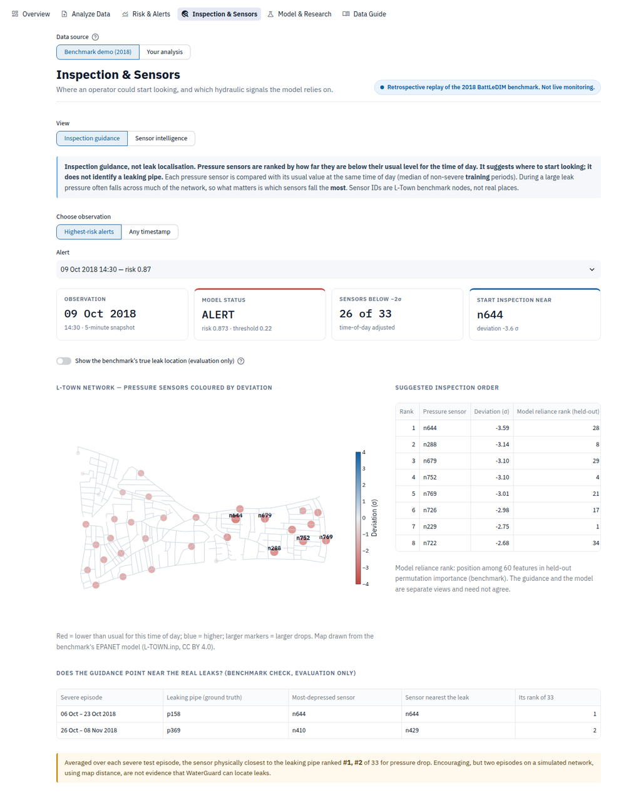
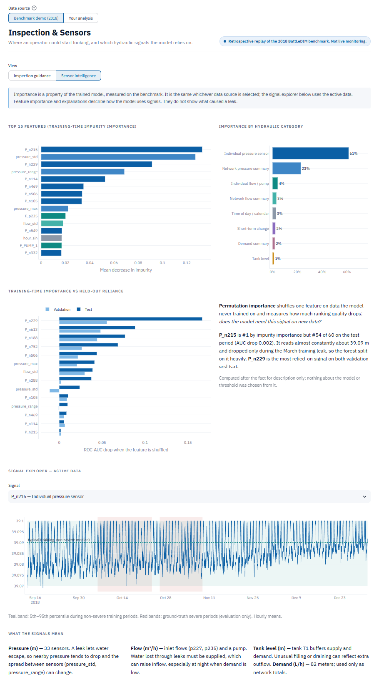
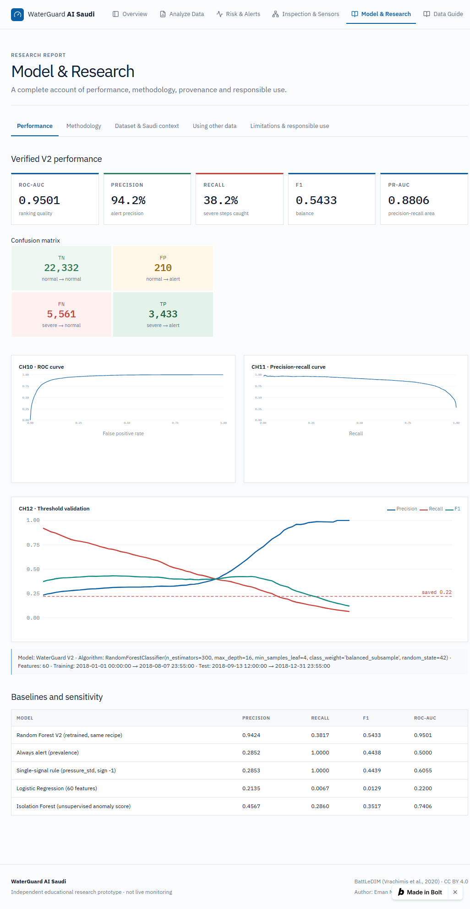
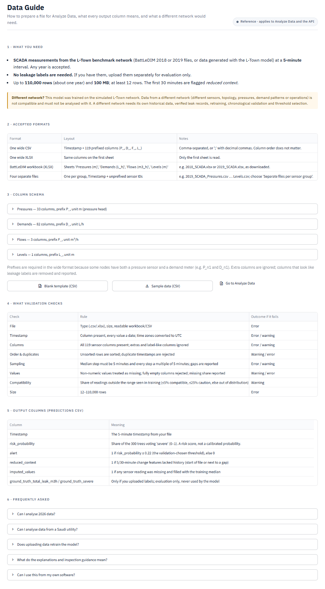

# WaterGuard AI Saudi

**A Saudi-focused water-loss decision-support research prototype, evaluated on the BattLeDIM L-Town international leakage-detection benchmark.** WaterGuard reads hydraulic SCADA data (pressures, flows, demands, tank level) every 5 minutes, estimates the risk of a severe water-loss period, explains each alert and suggests which pressure sensors to inspect first.

**[Live demo](https://waterguard-ai-produc-qien.bolt.host)** · **[API docs (Swagger)](https://waterguard-ai-saudi-production.up.railway.app/docs)** · **[Repository](https://github.com/emanmusheer2008-glitch/waterguard-ai-saudi)**

| | |
|---|---|
| **Verified test result** | Precision **0.9424** · Recall **0.3817** · F1 **0.5433** · ROC-AUC **0.9501** · PR-AUC **0.8806** (threshold 0.22) |
| **Model** | Random Forest, 60 engineered hydraulic features, chronological train / validation / held-out test |
| **Interfaces** | Public React frontend (Bolt) · Streamlit research interface · FastAPI inference API (Railway) |
| **Author** | Eman Musheer |

> **Data disclaimer.** WaterGuard is *motivated* by water loss in Saudi Arabia, but it is *trained and evaluated* on the **BattLeDIM L-Town** benchmark, a simulated international research network. None of the measurements come from Saudi Arabia, any Saudi utility or any Saudi government body.


*WaterGuard AI Saudi — public research dashboard and benchmark overview.*

WaterGuard includes a public React portfolio interface and a Streamlit research interface. The public interface presents the project and verified evaluation results, while the Streamlit interface provides the deeper analysis workflow used for data validation, inference, alert investigation and inspection guidance.

---

## Contents
[Problem](#problem) · [What WaterGuard does](#what-waterguard-does) · [Research question](#research-question) · [System workflow](#system-workflow) · [Analyze SCADA data](#analyze-scada-data) · [Risk & alert investigation](#risk--alert-investigation) · [Inspection guidance](#inspection-guidance) · [Model & research](#model--research) · [Verified performance](#verified-model-performance) · [Dataset](#dataset) · [Methodology](#methodology) · [Data guide](#data-format--data-guide) · [API](#api) · [Tech stack](#technology-stack) · [Repository structure](#repository-structure) · [Running locally](#running-locally) · [Testing](#testing) · [Limitations & open issues](#limitations-and-open-issues) · [Future work](#future-work) · [Author](#author)

---

## Problem
Water distribution networks lose water through leaks. Some leaks are small and run for months; others are large and build up over days. Utilities record pressures, flows and tank levels every few minutes, but nobody can watch hundreds of signals by hand.

**Saudi motivation.** Saudi Arabia's Ministry of Environment, Water and Agriculture (MEWA) identifies reducing losses in water networks as an improvement opportunity in its National Water Strategy, which estimates network losses at more than 25% in different regions ([MEWA, National Water Strategy page](https://www.mewa.gov.sa/en/Ministry/Agencies/TheWaterAgency/Topics/Pages/Strategy.aspx), last edited 6 July 2025). This is the motivation for WaterGuard, not evidence about its performance: **Saudi context = motivation; BattLeDIM L-Town = experimental data.**

## What WaterGuard does
- **Flags severe water-loss periods.** For each 5-minute step it outputs a risk probability and raises an alert when risk ≥ 0.22.
- **Explains each alert.** It shows which hydraulic signals pushed the risk up compared with typical conditions.
- **Suggests where to start inspecting.** It ranks pressure sensors by how far they have dropped below their usual level for that time of day.
- **Analyses new data.** Upload L-Town-compatible SCADA data and get validation, risk, alerts, explanations and a predictions CSV. No labels are needed and nothing is retrained.
- **Shows the verified evaluation.** The held-out 2018 test period is replayed with ground truth (evaluation only), so hits *and misses* are visible.

It is a decision-support research prototype, **not** a live monitoring system and **not** a leak locator.

## Research question
*Can machine-learning analysis of pressure, flow, demand and tank-level patterns identify network conditions associated with severe water-loss periods in a benchmark distribution network — and how reliably does it work on a later period the model has never seen?*

## System workflow
**Inference pipeline (identical for the benchmark and uploaded data):**
```
SCADA data → validation / cleaning → 60 engineered features → saved imputer → Random Forest
          → risk probability → threshold 0.22 → alert → explanation → inspection guidance
```

**Deployment:**

Neither interface contains model logic. Both call the same tested service functions (`read_table`, `validate_input`, `prepare_features`, `run_inference`, `explain_alert`, `generate_inspection_guidance`, `summarize_results`, `evaluate_against_ground_truth`). Training happened once, offline (`src/train_v2.py`); the applications only apply the saved artifacts. The public frontend's source code is hosted on Bolt and is not part of this repository.

## Analyze SCADA data
Upload a CSV/XLSX (or four per-group files). WaterGuard then:
1. **Validates** the file: timestamp column, all 119 sensor columns, 5-minute sampling, duplicates, gaps, missing values, and network compatibility (share of readings outside the training range).
2. **Rebuilds the 60 features** with the training code and applies the saved imputer, Random Forest and 0.22 threshold.
3. **Returns** summary cards, a risk timeline, the risk distribution, alert periods, an alert table with per-alert explanations, inspection guidance, and CSV/JSON export.

Optional ground-truth labels can be uploaded separately. They are joined **after** inference for evaluation and are never used by the model.


*Streamlit research interface — SCADA validation, model inference, risk timeline and alert analysis. The bundled sample file (real L-Town measurements from 4–7 Oct 2018, timestamps shifted to 2026) gives 1,152 observations, 258 alerts (22.4%), highest risk 0.753 and 62 alert periods.*

**2018 vs 2026 timestamps.** No calendar feature is used, so the sample shifted to 2026 gives exactly the benchmark probabilities from the 7th row onward. The first 30 minutes are flagged *reduced context* because the change features lack history. **Recent timestamps do not make data from another network compatible.** See [Limitations](#limitations-and-open-issues).

## Risk & alert investigation
The Risk & Alerts view combines a date-filtered risk monitor, an exploratory what-if threshold (clearly labelled; the model's threshold stays 0.22), the alert table and a detail panel. Selecting an alert re-scores it with **one key signal at a time** set to its typical value, which shows which signals pushed the risk up. A detection timeline is also available. The page works on the benchmark demo or on the user's own analysis, and the active data source is always shown.


*Streamlit research interface — risk scoring, alert periods and detailed alert investigation.*

Explanations describe how the model uses signals; they do not show what physically caused a leak.

## Inspection guidance
The Random Forest says *when* conditions look severe, not *where*. Separately, WaterGuard compares each of the 33 pressure sensors with its usual value at the same time of day (median of non-severe **training** periods) and ranks the largest drops on the L-Town network map. A leak lets water escape, so pressure near it tends to fall.

**Benchmark check (evaluation only):** averaged over each severe test episode, the sensor physically closest to the true leaking pipe ranked **#1 of 33** (pipe p158 → n644) and **#2 of 33** (p369 → n429). That is encouraging, but it is two episodes on a simulated network using map distance. **This is inspection guidance, not leak localisation.**


*Streamlit research interface — explainable sensor inspection guidance for flagged periods.*

**Which signals does the model rely on?** Training-time (impurity) importance ranks pressure sensor `P_n215` first. Held-out **permutation importance** ranks it **#54 of 60** on the test period: n215 is almost constant (≈ 39.09 m) and dropped only during one March training leak. `P_n229` is the most relied-on signal on both validation and test. Importance describes model behaviour, not causes.

<details>
<summary>Sensor intelligence view (impurity vs held-out permutation importance)</summary>



</details>

## Model & research
The research view presents the held-out evaluation, the confusion matrix, ROC and precision–recall curves, the validation threshold curve, baselines and the full methodology, dataset provenance and limitations.


*Model & Research — held-out evaluation, performance metrics and threshold analysis.*

## Verified model performance
Held-out test period **13 Sep – 31 Dec 2018** (31,536 five-minute steps), threshold **0.22** chosen on validation only:

| Precision | Recall | F1 | ROC-AUC | PR-AUC | Accuracy |
|---:|---:|---:|---:|---:|---:|
| **0.9424** | **0.3817** | **0.5433** | **0.9501** | 0.8806 | 0.8170 |

| | Predicted not severe | Predicted severe |
|---|---:|---:|
| **Actually not severe** | TN = 22,332 | FP = 210 |
| **Actually severe** | FN = 5,561 | TP = 3,433 |

**How to read it.** WaterGuard raised 3,643 alerts; 3,433 were during genuinely severe periods (precision 94%). It **missed 5,561 of 8,994 severe steps** (recall 38%). **94% precision does not mean 94% of leaks are detected.** The severe test steps form only **two** episodes (pipe p158, 6–23 Oct; p369, 26 Oct–8 Nov). The model alerted at the first step of both and covered 47.6% and 26.2% of them.

| Baseline (same split; thresholds chosen on validation) | Precision | Recall | F1 | ROC-AUC |
|---|---:|---:|---:|---:|
| **Random Forest V2** | **0.9424** | 0.3817 | **0.5433** | **0.9501** |
| Always alert | 0.2852 | 1.0000 | 0.4438 | 0.5000 |
| Single signal (`pressure_std`) | 0.2853 | 1.0000 | 0.4439 | 0.6055 |
| Logistic Regression (60 features) | 0.2135 | 0.0067 | 0.0129 | 0.2200 |
| Isolation Forest (unsupervised) | 0.4567 | 0.2860 | 0.3517 | 0.7406 |

**V1 baseline (kept as an honest record):** 20 aggregate features including `month` (its top feature, importance 0.229), 70/30 split and the default 0.5 threshold. It scored precision 0.4255, recall 0.0022, F1 0.0044, ROC-AUC 0.8602, with only 47 alerts: good ranking but useless at the default threshold. That result motivated V2.

**Severity sensitivity (supplementary retraining):** F1 0.7864 at ≥ 30 m³/h, 0.6775 at ≥ 35, 0.5814 at ≥ 37.56 (training-only 80th percentile), 0.5433 at ≥ 40, 0.4688 at ≥ 45; ≥ 50 has no positives.

## Dataset
- **BattLeDIM 2020** (Battle of the Leakage Detection and Isolation Methods), **L-Town** network, 2018 historical files: Vrachimis et al. (2020), Zenodo, [doi:10.5281/zenodo.4017659](https://doi.org/10.5281/zenodo.4017659), licence **CC BY 4.0**; competition site <https://battledim.ucy.ac.cy/>.
- 105,120 timestamps at 5-minute resolution: 33 pressure (m), 82 demand (L/h), 3 flow (m³/h) and 1 tank-level (m) signal; leakage (m³/h) at 14 pipes. No gaps, duplicates or missing values; all sheets row-aligned.
- The leakage CSV uses `;` separators and decimal commas (pandas defaults fail with a `ParserError` at line 2312).
- **Target.** In 97.8% of timestamps at least one small leak is active, so "any leak > 0" is useless as a target. A step is **severe** when total leakage **≥ 40 m³/h** (≈ 80th percentile of 2018). This is an **experimental modelling threshold**, not an engineering, BattLeDIM, utility, regulatory or Saudi standard.

## Methodology
- **Features (60, current and past values only):** 33 individual pressures; pressure mean/min/max/std/range; demand total/mean/std; 3 flows plus total/mean/std; tank level; hour of day as sin/cos; 5- and 30-minute changes of pressure mean/min/std, flow total and tank level. **No calendar month.**
- **Chronological split (no shuffling):** train 1 Jan – 7 Aug (63,072 rows, 16.9% severe) · validation 8 Aug – 13 Sep (10,512 rows, 13.0%) · test 13 Sep – 31 Dec (31,536 rows, 28.5%).
- **Model:** `RandomForestClassifier(n_estimators=300, max_depth=16, min_samples_leaf=4, class_weight="balanced_subsample", random_state=42)`; median imputer fitted on training rows only.
- **Threshold:** best F1 on the **validation** period → 0.22 (validation precision 0.3109, recall 0.7036, F1 0.4312). The test period is scored once.
- **Leakage controls:** ground truth is never a feature; features are causal; preprocessing is fitted on training data only; tuning uses validation only. Each control is enforced by an automated test.
- **Reproducibility:** retraining from raw data reproduces the saved probabilities to within 3e-16; re-running the experiments gives byte-identical files.

More detail: [`PROJECT_REPORT.md`](PROJECT_REPORT.md) (academic write-up), [`DEVELOPMENT_LOG.md`](DEVELOPMENT_LOG.md) (what went wrong and how it was fixed), [`LEARNING_GUIDE.md`](LEARNING_GUIDE.md) (concepts and 38 interview questions).

## Data format / Data guide
One row per **5-minute** timestamp, any year, from the **L-Town** network:

| Group | Prefix | Columns | Unit |
|---|---|---:|---|
| Pressures | `P_` | 33 (`P_n1 … P_n769`) | m |
| Demands | `D_` | 82 (`D_n1 …`) | L/h |
| Flows | `F_` | 3 (`F_p227`, `F_p235`, `F_PUMP_1`) | m³/h |
| Tank level | `L_` | 1 (`L_T1`) | m |

Plus a `Timestamp` column. Accepted formats: wide CSV (`,` or `;` with decimal commas), wide XLSX, the BattLeDIM 4-sheet workbook as downloaded, or four separate per-group files. Limits: 100 MB and 12–110,000 rows. A blank template, a sample and sample labels are in [`samples/`](samples/README.md).


*Streamlit Data Guide — expected SCADA schema, sensor groups and input requirements.*

## API
Public instance: <https://waterguard-ai-saudi-production.up.railway.app> · interactive docs: [`/docs`](https://waterguard-ai-saudi-production.up.railway.app/docs) · full contract with example responses: [`docs/API.md`](docs/API.md).

| Method | Path | Purpose |
|---|---|---|
| GET | `/health` | Liveness and model status |
| GET | `/model-info` | Model configuration, threshold, verified metrics, approved wording |
| GET | `/sample-schema`, `/sample-files/{name}` | Input schema; template, sample and sample labels |
| POST | `/analyze` | Validate an uploaded file and run the saved model |
| POST | `/analyze-groups` | Same, for four per-group files |
| POST | `/explain` | Explanation + inspection guidance for one timestamp |
| GET | `/benchmark`, `/benchmark/timeline`, `/benchmark/explain` | Verified benchmark results, timeline, explanations |
| GET | `/network` | L-Town map geometry |

```bash
curl -F "file=@samples/waterguard_sample_ltown2018_shifted_to_2026.csv" \
     "https://waterguard-ai-saudi-production.up.railway.app/analyze?include_predictions=false"
```
Uploads are processed in memory (100 MB limit), never stored, and errors are returned as structured JSON. Deployment is configured in [`railway.json`](railway.json).

## Technology stack
| Layer | Tools |
|---|---|
| Data & ML | Python 3.13, pandas, NumPy, scikit-learn (Random Forest), joblib |
| Research interface | Streamlit, Plotly |
| API | FastAPI, Uvicorn, python-multipart; deployed on Railway |
| Public frontend | React, built and hosted with Bolt (separate from this repository) |
| Quality | pytest (pipeline, service, API and app tests), deterministic training (seed 42) |
| Safe file parsing | openpyxl with defusedxml, in-memory uploads |

## Repository structure
```
waterguard-ai-saudi/
├── app.py                         # Streamlit entry point (6 sections)
├── ui/                            # Streamlit UI only: common.py + pages/
├── api/main.py                    # FastAPI inference API
├── railway.json                   # Railway start command + health check
├── src/waterguard/
│   ├── service.py                 # inference service: read, validate, features, infer, explain, inspect, summarise
│   ├── schema.py  wording.py      # input schema; approved scientific wording
│   └── config.py  data.py  features.py  target.py  evaluation.py  inspection.py  dashboard_data.py
├── src/train_v1.py  src/train_v2.py  src/*.py   # original research scripts (the reported models)
├── scripts/                       # download data, build dashboard/inspection/inference files, experiments
├── models/                        # V2 artifacts (committed) + inference reference files
├── outputs/                       # verified benchmark results + dashboard files
├── samples/                       # template, sample (2018 data shifted to 2026), sample labels
├── data/                          # raw benchmark data (git-ignored; download script)
├── tests/                         # pytest suite
├── docs/                          # API.md, FRONTEND_SPEC.md, PORTFOLIO.md, ACCEPTANCE_CHECKLIST.md, screenshots/
├── DEVELOPMENT_LOG.md  LEARNING_GUIDE.md  PROJECT_REPORT.md
└── requirements.txt  requirements-api.txt  requirements-dev.txt
```

## Running locally
```bash
git clone https://github.com/emanmusheer2008-glitch/waterguard-ai-saudi.git
cd waterguard-ai-saudi
python -m venv .venv
# Windows: .venv\Scripts\activate      macOS/Linux: source .venv/bin/activate
pip install -r requirements.txt          # Python >= 3.12 (3.13 verified); for tests: requirements-dev.txt
```
**Streamlit research interface** (needs only committed files):
```bash
python -m streamlit run app.py           # http://localhost:8501
```
**FastAPI backend:**
```bash
python -m uvicorn api.main:app --host 127.0.0.1 --port 8000     # docs at http://127.0.0.1:8000/docs
```
**Reproduce the research from raw data:**
```bash
python scripts/download_data.py           # BattLeDIM 2018 files + L-TOWN.inp (~100 MB)
python src/train_v1.py                    # V1 baseline
python src/train_v2.py                    # V2 model (deterministic, seed 42)
python scripts/build_inspection_data.py   # inspection guidance, network map, permutation importance
python scripts/build_dashboard_data.py    # verifies the saved V2 reproduces predictions
python scripts/build_inference_reference.py
python scripts/run_experiments.py         # baselines + sensitivity (~4 min)
```

## Testing
```bash
pip install -r requirements-dev.txt
python -m pytest -q
```
The suite covers data parsing and integrity, causal features without ground truth, split ordering, the verified V1/V2 metrics and threshold, model artifacts, the inference service (valid data, 2026 timestamps, missing/extra/duplicate/unsorted data, gaps, invalid sampling, malformed CSV/XLSX, out-of-distribution values, ground-truth exclusion, explanations, full-benchmark equivalence), every API endpoint and every Streamlit section. With the raw BattLeDIM data present, **95 tests pass**. On a fresh clone without raw data, the data-dependent tests are skipped (89 passed, 6 skipped).

## Limitations and open issues
These are known and **not** solved in this version.

| # | Issue | Why it matters |
|---|---|---|
| 1 | **Recall is 38%.** The model often alerts at the start of an episode, then drops below threshold. | Many severe periods are missed. Episode-aware alerting (persistence/hysteresis) was not implemented. |
| 2 | **Only two severe episodes in the test period** (five in all of 2018). | Event-level performance cannot be generalised. |
| 3 | **Experimental severity threshold.** 40 m³/h was read from the full-year 2018 distribution. | Not a standard. In BattLeDIM **2019**, leakage is much higher and 82% of steps exceed 40 m³/h, so the definition does not transfer between years. |
| 4 | **Non-stationary leak signatures.** Logistic Regression ranks the test period worse than random (AUC 0.22). | Performance may not carry over to new leaks or years. |
| 5 | **Misleading top feature.** `P_n215` dominates impurity importance but contributes little on held-out data. | Impurity importance alone would mislead interpretation. |
| 6 | **No leak localisation.** Inspection guidance is a heuristic checked on two episodes with map distance. | It suggests where to start, not where the leak is. |
| 7 | **L-Town only.** The model works only on data from the simulated L-Town network. | Saudi or any other network data needs its own labelled history, retraining, chronological validation and threshold selection. No real Saudi data was used. |
| 8 | **Uncalibrated probabilities**; 5-minute steps are strongly correlated. | Risk scores rank well but are not true probabilities; step-level metrics overstate the effective sample size. |
| 9 | **Public API hardening.** There is no authentication or rate limiting, CORS allows any origin by default, and large XLSX uploads are slow (~1.5 min for the 92 MB BattLeDIM workbook). | Fine for a research demo; not production-ready. |
| 10 | **Stateless API.** `/explain` needs the file uploaded again. | Simple and private, but inefficient for large files. |
| 11 | **Not covered here:** the Bolt frontend source is not in this repository; there is no CI workflow yet; no licence has been chosen for the project's own code. | Repository housekeeping. |

**Supplementary unseen-year check (not a result).** The official BattLeDIM 2019 workbook was analysed end to end through the upload pipeline and validated as compatible. Against the 2019 labels it scored precision 0.998, recall 0.678 and ROC-AUC 0.972. Because 82% of 2019 counts as "severe" under the 2018-derived threshold, "always alert" would already reach 0.82 precision, so these numbers are **not comparable** with the 2018 benchmark and do not replace it.

## Future work
Episode-aware alerting with event-level metrics; walk-forward validation across 2018; probability calibration on validation; a severity definition that transfers between years; model-based leak localisation with the L-Town hydraulic model; API authentication, rate limiting and asynchronous processing for large files; CI for the test suite; and, only under a proper data-sharing agreement, a network-specific model trained on real utility data.

## Responsible use
WaterGuard AI Saudi is an independent educational research prototype and is not affiliated with or endorsed by a Saudi government entity or water utility. It has not been validated on real Saudi network data and must not be used for operational decisions. It replays a 2018 benchmark; it is not live monitoring.

## Portfolio summary
Built WaterGuard AI Saudi, an ML-based water-loss decision-support research prototype using hydraulic SCADA time series, 60 engineered features, Random Forest classification, explainable alerts and sensor inspection guidance; achieved 0.950 ROC-AUC and 0.942 precision on a held-out BattLeDIM L-Town benchmark test period.

## Citations and licence
- Vrachimis, S. G., Eliades, D. G., Taormina, R., Ostfeld, A., Kapelan, Z., Liu, S., Kyriakou, M. S., Pavlou, P., Qiu, M., & Polycarpou, M. M. (2020). *Dataset of BattLeDIM: Battle of the Leakage Detection and Isolation Methods* (v1). Zenodo. https://doi.org/10.5281/zenodo.4017659 — CC BY 4.0.
- BattLeDIM competition website: https://battledim.ucy.ac.cy/
- Ministry of Environment, Water and Agriculture (MEWA). *National Water Strategy* (web page, last edited 6 July 2025). https://www.mewa.gov.sa/en/Ministry/Agencies/TheWaterAgency/Topics/Pages/Strategy.aspx

Raw BattLeDIM files are not committed (size); `scripts/download_data.py` fetches them. The sample in `samples/` is a CC BY 4.0 excerpt with shifted timestamps, redistributed with attribution. No licence has been chosen yet for this project's own code.

## Author
**Eman Musheer** — independent AI / data science portfolio project.
