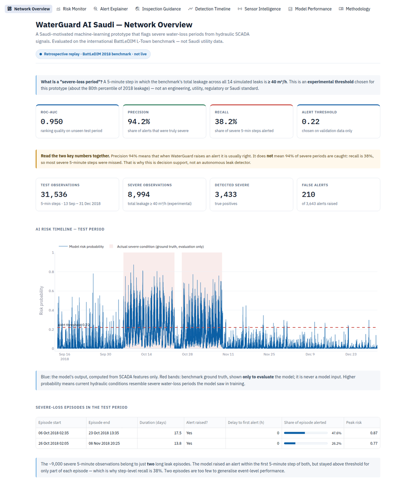
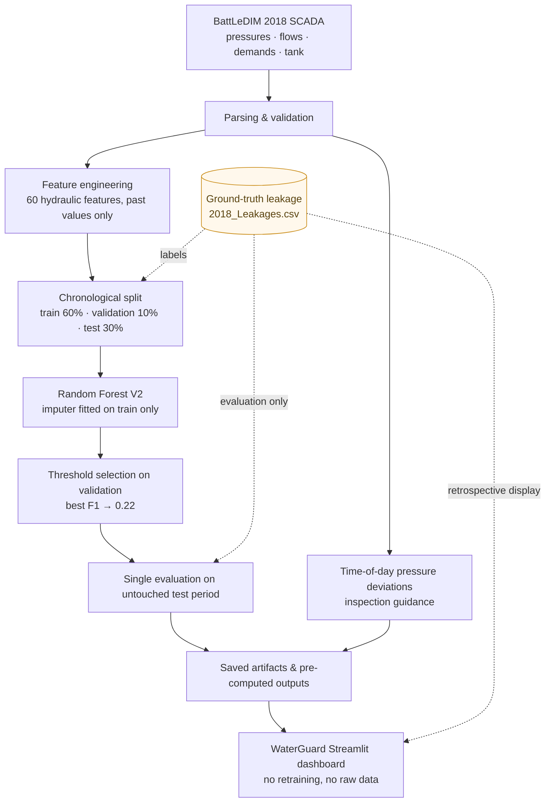
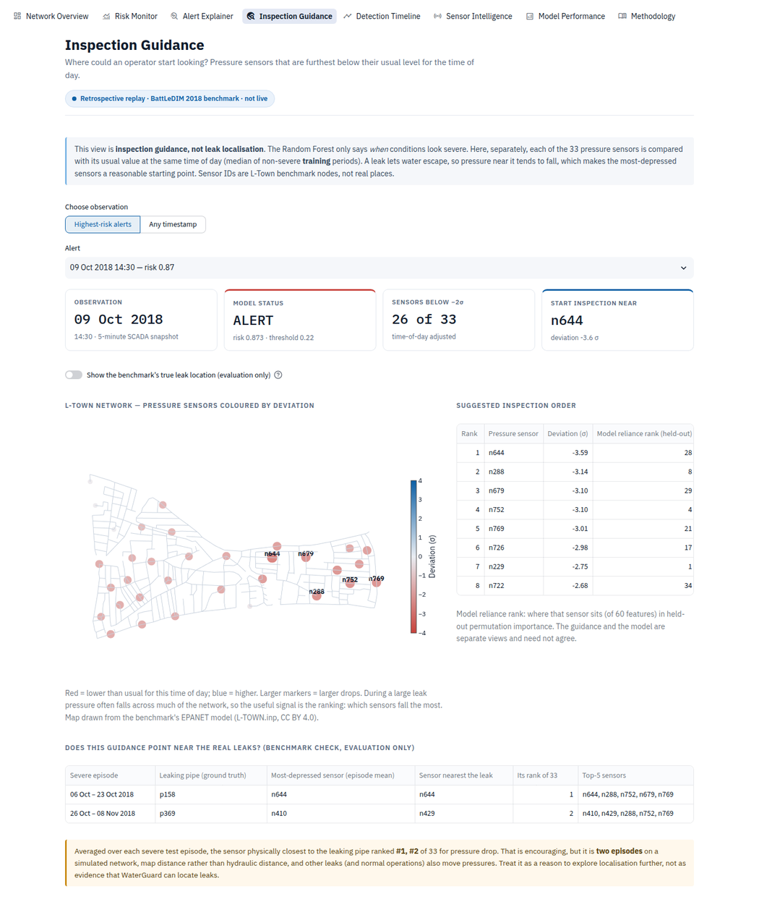
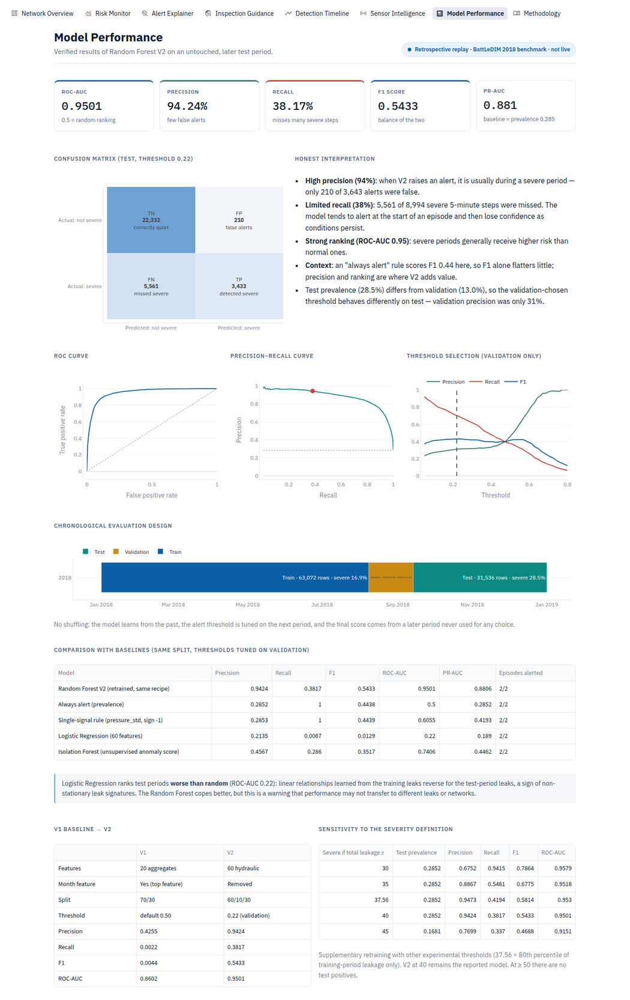

# WaterGuard AI Saudi

**A machine-learning decision-support prototype that flags severe water-loss periods in a water distribution network from hydraulic SCADA sensor data, and suggests which pressure sensors to inspect first.**

> **Data disclaimer.** WaterGuard is *motivated* by water loss in Saudi Arabia, but it is *evaluated* on the **BattLeDIM L-Town** international leakage-detection benchmark (a simulated network). None of the measurements come from Saudi Arabia, any Saudi utility or any Saudi government body.

| | |
|---|---|
| **Live demo** | _Not deployed yet — see [Deployment](#17-deployment)._ |
| **GitHub** | _Add the repository URL after publishing._ |
| **Model** | Random Forest V2 — 60 hydraulic features, chronological train / validation / test |
| **Verified test result** | Precision **94.24%** · Recall **38.17%** · F1 **0.5433** · ROC-AUC **0.9501** |
| **Stack** | Python 3.13 · pandas · scikit-learn · Plotly · Streamlit · pytest |
| **Author** | Eman Musheer |



---

## 1. Problem
Water networks lose water through leaks. Some leaks are small and last for months; others are large and build up over days. Utilities record pressures, flows and tank levels every few minutes (SCADA data), but nobody can watch hundreds of signals by hand. WaterGuard asks:

> *Where might we be losing significant amounts of water, why did the AI flag it, and where should operators start inspecting?*

## 2. Saudi relevance (motivation only)
Saudi Arabia's Ministry of Environment, Water and Agriculture (MEWA) publishes a National Water Strategy. Its current-state assessment lists the reduction of losses in the network as an opportunity to improve urban water use, and estimates those losses at more than 25% in different regions ([MEWA, National Water Strategy page](https://www.mewa.gov.sa/en/Ministry/Agencies/TheWaterAgency/Topics/Pages/Strategy.aspx), last edited 6 July 2025). Among the strategy's objectives is to *"enhance water demand management across all uses"*.

WaterGuard explores how sensor analytics *could* support that kind of work. **Saudi context = motivation and target application. BattLeDIM L-Town = experimental data.** The two are never merged: no result in this project says anything about performance on a Saudi network.

## 3. Research question
*Can machine-learning analysis of pressure, flow, demand and tank-level patterns identify network conditions associated with severe water-loss periods in a benchmark distribution network — and how reliably does it work on a later period the model has never seen?*

## 4. Dataset
- **BattLeDIM 2020** (Battle of the Leakage Detection and Isolation Methods), L-Town network, 2018 historical files. Vrachimis, S. G. et al., *Dataset of BattLeDIM*, Zenodo, 2020, [doi:10.5281/zenodo.4017659](https://doi.org/10.5281/zenodo.4017659). Licence **CC BY 4.0**. Competition site: <https://battledim.ucy.ac.cy/>.
- `2018_SCADA.xlsx` — 105,120 timestamps at 5-minute resolution (all of 2018). Sheets: `Pressures (m)` 33 sensors, `Demands (L_h)` 82 meters, `Flows (m3_h)` 3 (p227, p235, PUMP_1), `Levels (m)` 1 tank (T1).
- `2018_Leakages.csv` — leak flow in **m³/h** at 14 pipes (p31, p158, p183, p232, p257, p369, p427, p461, p538, p628, p654, p673, p810, p866). It uses `;` as separator and `,` as decimal mark: **pandas defaults fail with a `ParserError` at line 2312**, so it must be read with `sep=";", decimal=","`.
- `L-TOWN.inp` — the benchmark's EPANET network model; used only to draw the network map and to check the inspection guidance.
- Integrity (`outputs/audit_report.json`): no duplicate timestamps, no gaps, no missing values; all sheets and the leakage file are row-aligned.

## 5. Target definition — why "severe ≥ 40 m³/h"
In **97.8%** of timestamps at least one leak is above zero, because small leaks (p257, p427 and, from mid-year, p654 and p810) run for months. A "leak vs no leak" target would be "yes" almost all the time, so it teaches nothing.

WaterGuard instead labels a 5-minute step **severe** when **total leakage ≥ 40 m³/h**. 2018 total leakage has median 23.9, 75th percentile 33.3, **80th percentile 39.5**, 90th 46.5 and maximum 80.0 m³/h, so 40 is roughly the upper fifth (19.98% of timestamps).

**40 m³/h is an experimental modelling threshold created for this prototype.** It is not an engineering standard, a BattLeDIM competition rule, a utility or regulatory threshold, a safety standard or a Saudi/MEWA figure. The whole year contains only five severe episodes longer than an hour.

## 6. Architecture



The ground-truth leakage defines the labels and scores the results. It is **never** a model input.

## 7. Feature engineering (V2, 60 features)
| Group | Features |
|---|---|
| Individual pressures (33) | `P_n1 … P_n769` — local signals are lost in averages |
| Pressure summaries (5) | mean, min, max, std, range across the 33 sensors |
| Demand summaries (3) | total, mean, std across 82 meters |
| Flows (6) | `F_p227`, `F_p235`, `F_PUMP_1`, plus total, mean, std |
| Tank (1) | `tank_level` |
| Time of day (2) | `hour_sin`, `hour_cos` (so 23:55 and 00:00 are close) |
| Short-term change (10) | 5-minute and 30-minute differences of pressure mean/min/std, flow total, tank level |

Calendar month is **deliberately excluded** (see V1). All features use only the current and earlier timestamps.

## 8. Chronological evaluation design
| Split | Period | Rows | Severe rate |
|---|---|---:|---:|
| Train | 2018-01-01 00:00 → 2018-08-07 23:55 | 63,072 | 16.9% |
| Validation | 2018-08-08 00:00 → 2018-09-13 11:55 | 10,512 | 13.0% |
| Test | 2018-09-13 12:00 → 2018-12-31 23:55 | 31,536 | 28.5% |

No shuffling: neighbouring 5-minute readings are nearly identical, so a random split would put near-copies of training rows into the test set. The median imputer is fitted on training data only; the alert threshold is the best F1 on a 0.05–0.80 grid **on validation only**; the test period is scored once.

## 9. V1 baseline (kept on purpose)
Random Forest (200 trees, depth 14, min leaf 5, balanced class weights), 20 aggregate features including `month`, chronological 70/30 split, default threshold 0.5.

| TN | FP | FN | TP | Precision | Recall | F1 | ROC-AUC |
|---:|---:|---:|---:|---:|---:|---:|---:|
| 22,515 | 27 | 8,974 | 20 | 0.4255 | 0.0022 | 0.0044 | 0.8602 |

V1 could *rank* risk (AUC 0.86) but at the default 0.5 threshold it raised only 47 alerts in 3½ months. Its top feature was `month` (importance 0.229), suggesting it partly learned *when* 2018's leaks happened rather than what they look like hydraulically. Lessons: a default threshold can be useless, ROC-AUC alone hides operational failure, and feature design matters.

## 10. V2 — main model
`RandomForestClassifier(n_estimators=300, max_depth=16, min_samples_leaf=4, class_weight="balanced_subsample", random_state=42)` on the 60 features. Validation-selected threshold **0.22** (validation precision 0.3109, recall 0.7036, F1 0.4312).

### Final test results (untouched period, 13 Sep – 31 Dec 2018)
| | Predicted not severe | Predicted severe |
|---|---:|---:|
| **Actually not severe** | TN = 22,332 | FP = 210 |
| **Actually severe** | FN = 5,561 | TP = 3,433 |

| Precision | Recall | F1 | ROC-AUC | PR-AUC | Accuracy |
|---:|---:|---:|---:|---:|---:|
| **0.9424** | **0.3817** | **0.5433** | **0.9501** | 0.8806 | 0.8170 |

**How to read it.** V2 raised 3,643 alerts and 3,433 were during genuinely severe periods (precision 94%). It **missed 5,561 of the 8,994 severe 5-minute steps** (recall 38%). So: few false alarms, many misses. **94% precision does not mean 94% of leaks are detected.** Accuracy (82%) is not the headline because 71% of test steps are non-severe.

### What the numbers hide
- **Two episodes only.** The 8,994 severe test steps form just two leak episodes: 6–23 Oct (pipe p158) and 26 Oct–8 Nov (p369). V2 alerted at the first 5-minute step of both, then stayed above threshold for 47.6% and 26.2% of their duration. Two episodes are too few for event-level claims.
- **Prevalence shift.** Severe steps are 13.0% of validation but 28.5% of test, which is a large part of why validation precision (0.31) and test precision (0.94) differ.
- **F1 context.** "Always alert" already scores F1 0.444 here, so V2's value is in precision and ranking, not F1.

### Baselines (same split; every threshold chosen on validation) — `scripts/run_experiments.py`
| Model | Precision | Recall | F1 | ROC-AUC |
|---|---:|---:|---:|---:|
| **Random Forest V2** | **0.9424** | 0.3817 | **0.5433** | **0.9501** |
| Always alert | 0.2852 | 1.0000 | 0.4438 | 0.5000 |
| Single signal (`pressure_std`; validation-tuned rule ends up alerting almost always) | 0.2853 | 1.0000 | 0.4439 | 0.6055 |
| Logistic Regression (60 features) | 0.2135 | 0.0067 | 0.0129 | 0.2200 |
| Isolation Forest (unsupervised) | 0.4567 | 0.2860 | 0.3517 | 0.7406 |

Logistic Regression ranks the test period **worse than random**: linear relationships learned from the training-period leaks reverse for the test-period leaks. That is evidence that leak signatures are non-stationary, and a real caution about generalisation.

### Sensitivity to the severity definition (supplementary retraining; V2 at 40 stays the reported model)
| Severe if total ≥ (m³/h) | Test prevalence | Precision | Recall | F1 | ROC-AUC |
|---:|---:|---:|---:|---:|---:|
| 30 | 28.5% | 0.6752 | 0.9415 | 0.7864 | 0.9579 |
| 35 | 28.5% | 0.8867 | 0.5481 | 0.6775 | 0.9518 |
| 37.56 (training-only 80th percentile) | 28.5% | 0.9473 | 0.4194 | 0.5814 | 0.9530 |
| **40 (V2)** | 28.5% | **0.9424** | **0.3817** | **0.5433** | **0.9501** |
| 45 | 16.8% | 0.7699 | 0.3370 | 0.4688 | 0.9151 |
| 50 | no positives in validation or test | – | – | – | – |

## 11. Feature importance — two views, read carefully
**Training-time (impurity) importance**, top 10: `P_n215`, `pressure_std`, `P_n229`, `pressure_range`, `P_n114`, `P_n469`, `P_n506`, `P_n105`, `pressure_max`, `F_p235`. Individual pressure sensors hold 61% of total importance, pressure summaries 23%.

**Held-out permutation importance** (shuffle one feature on validation or test data and measure the ROC-AUC drop) tells a different story. `P_n229` is the most relied-on feature on both validation (AUC drop 0.056) and test (0.167). `P_n215`, #1 by impurity, is **#54 of 60 on test** (drop 0.002). n215 reads almost constantly about 39.09 m in 0.01 m steps. It dropped (to 38.96 m on average) only during the March training leak on pipe p673, so the forest split on it heavily; in every other severe episode it stayed at about 39.09 m.

Either way, these features **contributed strongly to the Random Forest's predictions**. Importance describes model behaviour; it does **not** prove that a sensor or location caused any leak. Sensor IDs are L-Town node names, not real places.

## 12. Inspection guidance — "where should operators look first?"
The Random Forest says *when* the network looks severe, not *where*. Separately, WaterGuard compares each of the 33 pressure sensors with its usual value at the same time of day (median of non-severe **training** periods) and ranks the sensors with the biggest drops. A leak lets water escape, so pressure near it tends to fall.

**Benchmark check (evaluation only).** Averaged over each severe test episode, the sensor physically closest to the true leaking pipe ranked **#1 of 33** (p158 → n644) and **#2 of 33** (p369 → n429) for pressure drop. That is encouraging, but it is two episodes, on a simulated network, using map distance. It is **inspection guidance, not leak localisation**.

## 13. Dashboard (8 pages, all from pre-computed `outputs/`)
| Page | What it shows |
|---|---|
| **Network Overview** | Plain-language KPIs, the severe-period definition, the precision-vs-recall explanation, the risk timeline with ground-truth bands, and the episode table |
| **Risk Monitor** | Date-range filter, an exploratory what-if threshold (clearly labelled), the highest-risk table, and CSV export of alerts |
| **Alert Explainer** | One observation: signal values against typical training ranges, plus local "risk change if this signal were typical" sensitivity |
| **Inspection Guidance** | L-Town network map with pressure sensors coloured by time-of-day-adjusted deviation, the suggested inspection order, and the ground-truth check (toggle) |
| **Detection Timeline** | Ground-truth leakage with alerts on top and model risk below, on a shared time axis |
| **Sensor Intelligence** | Impurity vs held-out permutation importance, importance by category, and a signal explorer with typical bands |
| **Model Performance** | Confusion matrix, ROC and PR curves, validation threshold curve, split diagram, baselines, V1 vs V2, severity sensitivity |
| **Methodology** | Saudi-vs-benchmark distinction, research question, provenance, pipeline, limitations, future architecture, disclaimer |

Every page carries the badge *"Retrospective replay · BattLeDIM 2018 benchmark · not live"*; ground truth is always labelled *evaluation only*. The app loads its data in about 0.7 s and never retrains or reads the raw data.

| Inspection Guidance | Model Performance |
|---|---|
|  |  |

## 14. Repository structure
```
waterguard-ai-saudi/
├── app.py                         # Streamlit dashboard (8 pages)
├── requirements.txt               # pinned runtime dependencies (verified together)
├── requirements-dev.txt           # + pytest
├── .streamlit/config.toml         # theme
├── src/
│   ├── inspect_data.py  analyze_leaks.py  severity_analysis.py   # original exploration
│   ├── train_v1.py  train_v2.py   # original training scripts (the reported models)
│   └── waterguard/                # importable, tested pipeline code
│       ├── config.py  data.py  features.py  target.py
│       ├── evaluation.py          # metrics + episode-level analysis
│       ├── inspection.py          # time-of-day pressure deviations, .inp parsing
│       └── dashboard_data.py
├── scripts/
│   ├── download_data.py           # fetch BattLeDIM files from Zenodo
│   ├── build_dashboard_data.py    # re-applies saved V2, verifies reproduction, exports dashboard files
│   ├── build_inspection_data.py   # inspection guidance, network map, permutation importance
│   └── run_experiments.py         # baselines + sensitivity analyses
├── outputs/                       # verified predictions + dashboard/experiment files (committed, ~8 MB)
├── models/                        # *.joblib (git-ignored; regenerate with src/train_v*.py)
├── data/                          # raw benchmark data (git-ignored; see data/README.md)
├── tests/                         # pytest suite
├── docs/                          # screenshots, portfolio kit, acceptance checklist
├── DEVELOPMENT_LOG.md             # what happened, what went wrong, how it was fixed
├── LEARNING_GUIDE.md              # plain-language concepts + interview Q&A
└── PROJECT_REPORT.md              # academic-style report
```

## 15. Installation and reproduction
```bash
git clone <your-repo-url> waterguard-ai-saudi
cd waterguard-ai-saudi
python -m venv .venv
# Windows: .venv\Scripts\activate      macOS/Linux: source .venv/bin/activate
pip install -r requirements-dev.txt     # pinned versions need Python >= 3.12 (3.13 verified)
```

**Run the dashboard** (needs only `outputs/`, which is committed):
```bash
streamlit run app.py
```

**Reproduce everything from raw data** (run from the project root):
```bash
python scripts/download_data.py          # 2018_SCADA.xlsx, 2018_Leakages.csv, L-TOWN.inp  (~100 MB)
python src/train_v1.py                   # V1 -> models/, outputs/                 (~1.5 min)
python src/train_v2.py                   # V2 -> models/, outputs/                 (~1.5 min)
python scripts/build_inspection_data.py  # inspection + permutation importance     (~1.5 min)
python scripts/build_dashboard_data.py   # verifies saved V2 reproduces predictions, exports dashboard files
python scripts/run_experiments.py        # baselines + sensitivity                 (~4 min)
```
Training is deterministic (`random_state=42`). Retraining V2 from scratch reproduces the saved test probabilities to within 3e-16 (floating-point rounding), and the regenerated experiment files are byte-identical.

## 16. Testing
```bash
python -m pytest -q
```
The suite covers: leakage-CSV parsing (semicolons, decimal commas, and the real file's failure with defaults); SCADA sheet names, sensor counts and timestamp alignment; V1/V2 feature generation (20/60 features, no month in V2, causal features, no ground-truth columns); target and threshold logic; chronological split ordering; verified V1/V2 metrics; validation-selected threshold; model, imputer, feature-list and threshold loading; probabilities in [0, 1]; dashboard outputs; inspection-guidance maths and `.inp` parsing; and a render test of every dashboard page and key interactions. Tests needing raw data or model files are **skipped** (not failed) on a fresh clone.

## 17. Deployment
Target: **Streamlit Community Cloud** (free). The app needs only `app.py`, `src/waterguard/`, `outputs/`, `.streamlit/` and `requirements.txt` — no raw data, no model files, no API keys or secrets.
1. Push this repository to a **public** GitHub repo.
2. At <https://share.streamlit.io> choose **Create app → Deploy a public app from GitHub**, select the repo, branch `main`, main file `app.py`. Under **Advanced settings** pick **Python 3.13**.
3. Paste the resulting `https://<name>.streamlit.app` URL into the "Live demo" row above.

## 18. Limitations
- Simulated benchmark network, one year; only **two** severe episodes in the test period (five in the whole year).
- **Recall is limited (38%)** — the model often alerts at the start of an episode and then drops below threshold.
- The 40 m³/h threshold was read from the full-year distribution (label definition only; no feature leakage). A training-only percentile (37.56) gives similar results.
- Leak signatures shift over time (Logistic Regression AUC 0.22); the top impurity feature (n215) contributes little on held-out data.
- The model says **when**, not **where**; the inspection guidance is a heuristic checked on two episodes.
- Probabilities are not calibrated. Metrics are per 5-minute step, and neighbouring steps are strongly correlated.

## 19. Responsible use
WaterGuard AI Saudi is an independent educational research prototype and is not affiliated with or endorsed by a Saudi government entity or water utility. It has not been validated on real Saudi network data and must not be used for operational decisions. It replays a 2018 benchmark; it is not live monitoring. Feature importance, the Alert Explainer and the Inspection Guidance describe **model and sensor behaviour**, not the physical causes or confirmed locations of leaks.

## 20. Future work
Evaluate on the independent BattLeDIM **2019** data; episode-aware alerting (persistence / hysteresis) with event-level metrics; walk-forward validation across 2018; probability calibration fitted on validation; model-based leak localisation with the L-Town hydraulic model; and, only under a proper data-sharing agreement, testing on real utility data.

A possible real-world system (**future, does not exist**): utility SCADA stream → real-time validation and features → trained model → risk scoring → operator dashboard → field inspection → inspection outcomes fed back as new labels.

## 21. Citations
- Vrachimis, S. G., Eliades, D. G., Taormina, R., Ostfeld, A., Kapelan, Z., Liu, S., Kyriakou, M. S., Pavlou, P., Qiu, M., & Polycarpou, M. M. (2020). *Dataset of BattLeDIM: Battle of the Leakage Detection and Isolation Methods* (v1) [Data set]. Zenodo. https://doi.org/10.5281/zenodo.4017659 — CC BY 4.0.
- BattLeDIM competition website: https://battledim.ucy.ac.cy/
- Ministry of Environment, Water and Agriculture (MEWA), Kingdom of Saudi Arabia. *National Water Strategy* (web page, last edited 6 July 2025). https://www.mewa.gov.sa/en/Ministry/Agencies/TheWaterAgency/Topics/Pages/Strategy.aspx

## 22. Licence and data
The BattLeDIM data is CC BY 4.0, which allows redistribution with attribution. The raw files are still **not committed** because of their size (the 92 MB workbook is above GitHub's 50 MB warning). `scripts/download_data.py` fetches them from the official Zenodo record. Derived files in `outputs/` (predictions, the network map drawn from `L-TOWN.inp`) carry the same attribution. No licence has been chosen yet for this project's own code.
